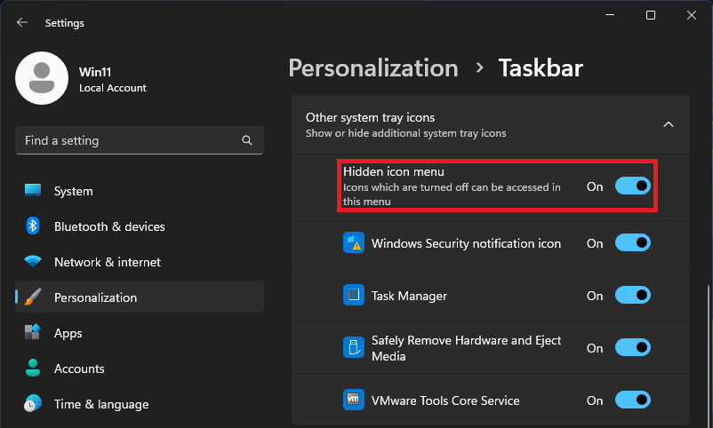

# "Always show all icons and notifications on the taskbar" fix
You no longer need to open “Settings > Personalization > Taskbar > Other system tray icons > [icon name] > Enable”

##  EnableAutoTray and explorer shell:::{...} don't work
It seems that in 24H2 Microsoft completely broke EnableAutoTray in the registry and control panel menu which can be opened using

    explorer shell:::{05d7b0f4-2121-4eff-bf6b-ed3f69b894d9}

## How to install it?
Click on the green **Code** button, then **Download ZIP**.    
Unzip to a convenient folder for you and run installer.bat    
Administrator privileges are **not** required.

## How to remove it?
Run installer.bat again

## How does it work?
The installer moves the minified script to your user folder, hides it, and creates a special PowerShell shortcut in the startup folder that runs the script in the background.    
Every 60 seconds, PowerShell enables ALL programs in the taskbar settings. So, if you install a new program, its icon will appear in the taskbar within 60 seconds. That is why the *Hidden icon menu* should always be enabled.

# Does it affect PC performance?
Theoretically, yes, but in practice it requires only about 30 MB of RAM and **much less** than 1% of the CPU. To reduce the already tiny performance impact, a minimized script is used and the process is assigned the lowest priority.